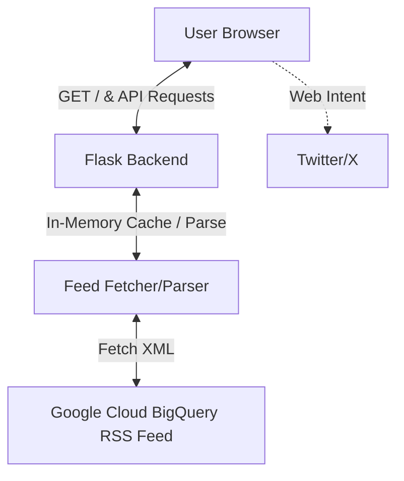

# BigQuery Release Notes Dashboard Design Spec

## Goal
Build a responsive, premium web application using Python Flask and vanilla HTML/JS/CSS that fetches the BigQuery release notes XML feed, allows keyword filtering and searching, and lets users tweet specific updates via Twitter/X Web Intents.

## Architecture

The application is structured as a single-page master-detail interface:
1. **Flask Backend**: Fetches the XML feed from Google, parses the release notes (title, publish date, content description, category), caches them in-memory, and exposes a clean JSON endpoint (`/api/releases`).
2. **Frontend (HTML/CSS/JS)**: Renders a premium master-detail layout. Real-time searching and filtering by category/keyword is handled on the client side.
3. **Twitter/X Integration**: Uses the official Twitter Web Intent API (`https://twitter.com/intent/tweet?text=...`) to open a pre-populated tweet draft in a new tab.

## Data Schema & Feed Parsing
The feed source is `https://docs.cloud.google.com/feeds/bigquery-release-notes.xml`.
Each entry in the feed has:
- `title` (e.g., "BigQuery release notes: June 15, 2026")
- `updated` or `published` date
- `content` (HTML description of changes)

We will parse the entry contents (which often contain `<h3>` tags or bullet points for individual release updates) into distinct, granular update items. For example, if a release note contains multiple updates (e.g., a Feature and a Deprecation), we will split them by their heading or list item to show them as separate card entries.

Each parsed update item will contain:
- `id`: Unique generated ID (hash of title/content)
- `title`: Short title of the specific update
- `date`: Publication date (ISO format and human-readable)
- `type`: Category/Type (e.g., `FEATURE`, `CHANGE`, `DEPRECATION`, `BUGFIX`) based on keywords in the header
- `content`: Full HTML content of the update
- `link`: Direct link to Google documentation

## Key Features & UI/UX Design
- **Theme**: Dark mode by default with a Toggle Switch in the header that overrides CSS variables to swap dynamically to a clean Light Mode. Elegant glassmorphism effects and soft color palettes are used in both modes.
- **Master-Detail Layout**:
  - **Left Column**: List of release updates sorted chronologically, with keyword search, category filters, a "Copy to Clipboard" utility button, relative publication dates (e.g. "Today", "2 days ago"), and unread status dots.
  - **Right Column**: Detailed view displaying the selected update's full text, publication date, and a prominent "Tweet this update" button.
- **Refresh State**: A spin animation on the refresh icon while fetching the newest feed data from the backend.
- **Export Utility**: An "Export to CSV" button that lets users download the currently active (searched/filtered) list of release notes as a CSV file.
- **UX Enhancements**:
  - **Toast Notifications**: Display non-intrusive notification popups on successful/failed updates or clipboard actions.
  - **Unread dots**: Track read status of updates using browser `localStorage` and display a small, elegant dot next to unread items.
  - **Relative dates**: Automatically translate publication dates into relative timestamps (e.g., "Today", "Yesterday").
  - **Keyboard navigation**: Support keyboard shortcuts (Up/Down arrow keys to navigate lists, Enter key to select/open notes).
- **Micro-interactions**: Hover effects, smooth transitions on selected items, fade-in animations on load.

## Security & Reliability
- **CORS**: Avoid browser CORS issues by having Flask fetch and parse the feed server-side.
- **In-Memory Cache**: Cache the parsed JSON on the backend for 1 hour to prevent rate-limiting or slow load times on subsequent page loads.
- **Network Resilience**: If the Google feed is down, serve cached notes and display a non-intrusive warning notification.

## Testing Strategy
- **Backend Tests**: Unit tests checking the RSS parsing logic with mock XML payloads.
- **Frontend Tests**: Validate searching and filtering functions locally.
